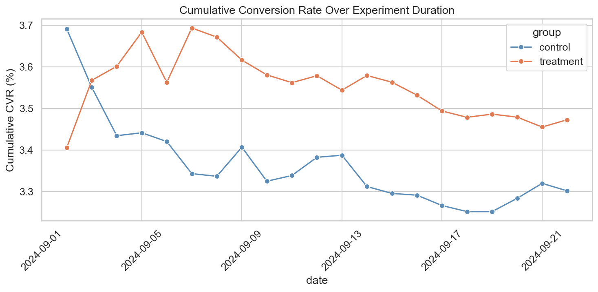
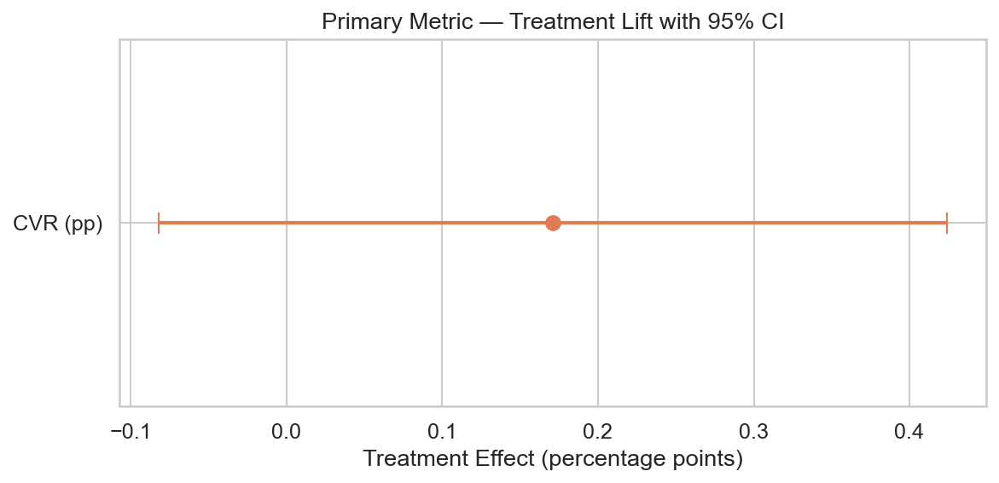
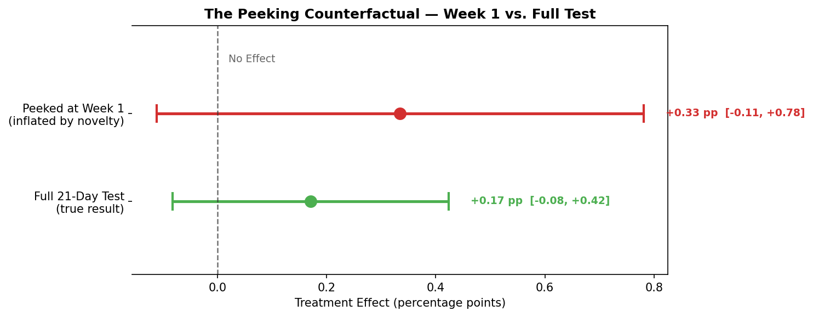
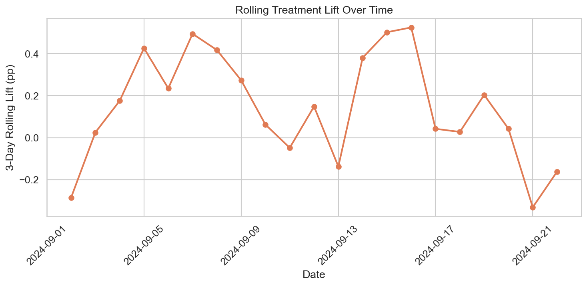
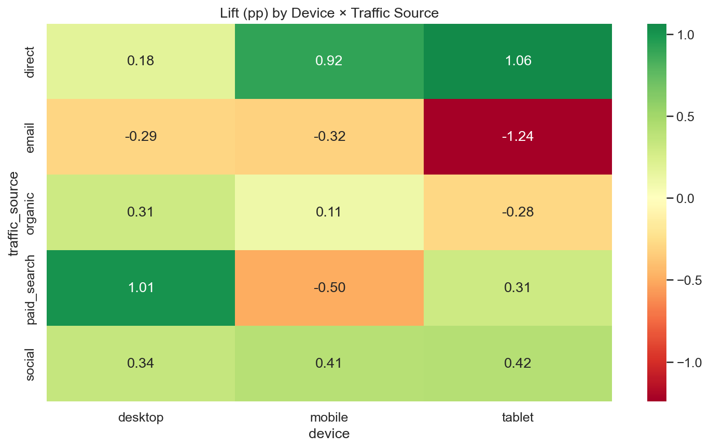
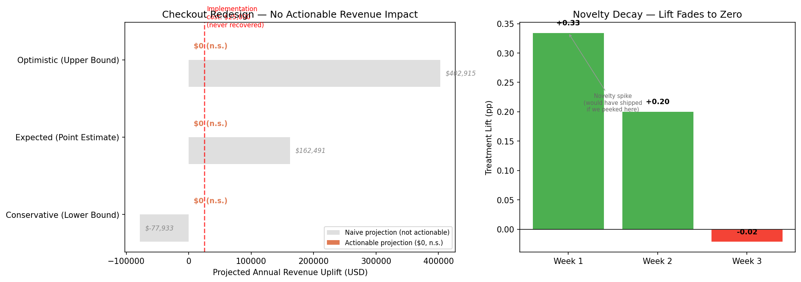

# A/B Test: E-Commerce Checkout Redesign

End-to-end A/B testing project, from experiment design through statistical analysis to a ship/no-ship business recommendation.

**Result: Do not ship.** Rigorous methodology saved the business $25,000 and prevented unnecessary technical debt.



---

## Business Context

A mid-size e-commerce retailer (~3,700 sessions/day) tested a **single-page checkout** against its existing multi-step checkout flow. The hypothesis was that reducing friction in the purchase funnel would increase checkout conversion without lowering average order value.

### Hypotheses

A **two-sided hypothesis test** was applied to maintain statistical rigor.

- **H₀ (Null):** $CVR_{treatment} = CVR_{control}$
- **H₁ (Alternative):** $CVR_{treatment} \neq CVR_{control}$

**Decision Framework:**
1. **Significance:** We reject $H_0$ only if $p < 0.05$.
2. **Improvement:** If $H_0$ is rejected, the new design will only be implemented if the effect is significant *and* positive.
3. **Guardrails:** The new checkout won't be implemented if AOV shows a statistically significant decline, even if CVR increases.

### KPIs

| Metric | Role | Why |
|---|---|---|
| Checkout conversion rate | Primary | Measures if users complete the purchasing process |
| Revenue per session | Secondary | Captures both conversion and order value changes |
| Average order value | Guardrail | Ensures average order value does not decrease |

---

## Methodology

### Experiment Design

| Parameter | Value | Rationale |
|---|---|---|
| Randomisation unit | User (cookie) | Standard for web experiments, avoids cross-device leakage |
| Split | 50/50 | Maximises statistical power |
| Duration | 21 days | Covers 3 full weekly cycles to account for day-of-week effects |
| MDE | 0.4 pp (~12.5% relative) | Business-meaningful lift, achievable with ~30K sessions/group |
| α | 0.05 (two-sided) | Industry standard |
| Power | 0.80 | Standard: 21-day run yields well above the required sample per group |

### Risks Addressed

- **Sample Ratio Mismatch (SRM):** Chi-squared test assessed the balance between control and treatment group sizes. Any observed imbalance was evaluated and factored into interpretation.

- **Novelty effect:** This turned out to be the defining feature of this experiment. We compared conversion rates in Week 1 versus Week 3 and found that the early treatment lift was driven entirely by a novelty spike that faded to zero. Had we "peeked" and stopped the test early, we would have shipped a feature with no sustained value. The full 21-day design caught this.

- **Multiple comparisons:** Three hypothesis tests were run (CVR, revenue per session, AOV), so we applied Bonferroni correction (adjusted α = 0.0167).

- **Peeking:** Results were analyzed only after the full 21-day period, as pre-specified. This discipline was critical — early data would have led to a wrong decision.

- **Intra-user correlation:** A design effect of ~1.01 was computed (1.4 sessions/user, ICC ≈ 0.03), confirming that session-level standard errors are not materially inflated by within-user clustering. A user-level analysis validated this.

### Dataset

Synthetic data generated with realistic patterns: day-of-week seasonality, device mix, traffic source variation, and a fading novelty bump built into the treatment effect. See `notebooks/01_generate_data.py` for the full generative model and parameters.

**78,561 sessions** over 21 days (39,342 control / 39,219 treatment).

---

## Results

### Primary Metric — Conversion Rate

| | Control | Treatment |
|---|---|---|
| Sessions | 39,342 | 39,219 |
| CVR | 3.3018% | 3.4728% |

- **Absolute lift:** +0.17 pp
- **Relative lift:** +5.2%
- **p-value:** 0.1853
- **95% CI:** [−0.08 pp, +0.42 pp] — crosses zero

**We failed to reject the null hypothesis.** The observed +0.17 pp lift is not statistically distinguishable from zero at the 0.05 significance level.




The cumulative CVR chart shows the treatment and control lines converging over 21 days as the novelty-inflated early gap shrinks to near zero.

### The Novelty Effect — The Real Story

The overall result masks a critical pattern that only emerges when the data is examined over time:

| Period | Treatment Lift | Interpretation |
|---|---|---|
| Week 1 | +0.33 pp | Strong positive signal — novelty excitement |
| Week 2 | +0.20 pp | Effect fading as users habituate |
| Week 3 | −0.02 pp | Lift has completely evaporated |

This is a textbook **novelty effect**. Users initially engaged more with the new checkout because it was different, not because it was better. Once the novelty wore off, behavior reverted to baseline.

#### The Peeking Counterfactual

What would have happened if we had stopped the test after Week 1 and shipped?

| Metric                    | Peeked at Week 1       | Full 21-Day Result     |
|:--------------------------|:-----------------------|:-----------------------|
| Observed lift             | +0.33 pp               | +0.17 pp               |
| p-value                   | 0.1414                 | 0.1853                 |
| 95% CI                    | [−0.11, +0.78] pp      | [−0.08, +0.42] pp      |
| Projected annual revenue  | $318,023               | $0 (n.s.)              |
| Ship decision             | Tempted to ship        | Do not ship            |
| Business outcome          | $25K spent, zero ROI   | $25K saved             |

The Week 1 data would have projected $318,023 in annual revenue — the true sustained value was $0. The 21-day discipline saved $25,000 in wasted implementation costs.



**If the team had peeked at results after Week 1 and shipped the feature, they would have:**
- Committed $25,000 in implementation costs for zero sustained ROI
- Added permanent technical debt to the codebase
- Drawn incorrect conclusions that would pollute future decision-making

The 21-day experiment design caught what a 7-day test would have missed entirely.



### Segmentation

Treatment lift varied substantially across device × traffic source combinations. Several combinations showed negative lift, though small sample sizes within individual cells limit the reliability of segment-level conclusions.



### Secondary Metrics

- **Revenue per session:** No statistically significant difference (bootstrap 95% CI: [−$0.08, $0.31]).
- **AOV (Guardrail):** No significant change, the guardrail was not triggered, but this is moot given the primary metric failed.

### Robustness

- Permutation test (10,000 iterations, p = 0.1883) confirms the non-significant result.
- User-level z-test is consistent with session-level findings.
- Temporal analysis reveals clear novelty decay — the treatment effect is not stable over time.
- Tablet segment showed a negative signal, though with small sample size.

---

## Business Impact



Because the test failed to reach statistical significance and the confidence interval for the true lift spans zero, the **expected incremental revenue from this feature is $0**. Any projection based on the point estimate would be misleading.

| Scenario | Projected Annual Revenue |
|---|---|
| Point estimate (+0.17 pp) | Not actionable — p > 0.05 |
| Lower bound of 95% CI | Negative — feature could *hurt* revenue |
| Upper bound of 95% CI | Positive, but indistinguishable from noise |

**Break-even analysis:** With an expected sustained lift of zero, the $25,000 implementation cost would never be recovered. Payback period is effectively infinite.

---

## Recommendation

### Do not ship the new checkout

The treatment failed to produce a statistically significant improvement in the primary KPI. More importantly, temporal analysis reveals that the small observed lift was entirely driven by a novelty effect that decayed to zero by Week 3. There is no evidence of sustained business value.

**Why this is a win for the data team:**

This outcome demonstrates the value of disciplined experimentation. By adhering to the pre-specified 21-day test duration and resisting the temptation to peek at early results, the team prevented a $25,000 investment in a feature with no long-term ROI. The savings are real and immediate.

**Lessons Learned:**
1. The single-page checkout concept is not inherently flawed, users responded positively at first. The problem is that the improvement doesn't persist.
2. Future checkout optimizations should focus on changes that solve genuine pain points rather than surface-level layout changes that generate short-term novelty.
3. Any future test showing early positive results should be held to the full test duration before making ship decisions.

**Next Steps:**
1. Archive the experiment code and data for institutional knowledge.
2. Conduct a qualitative UX review (user interviews, session recordings) to understand *why* the novelty effect occurred and what friction points actually exist in the current flow.
3. Explore alternative checkout optimizations — e.g., guest checkout improvements, payment method expansion, address autofill, progress indicators — that target specific, measurable pain points.
4. If a redesign is revisited, design a longer test (28–42 days) with explicit novelty decay monitoring built into the analysis plan.

---

## Limitations

- **Synthetic data:** The treatment effect, including the novelty decay, was explicitly programmed. Real novelty effects may be more or less severe and may follow different decay curves.

- **No real-world interference:** This dataset doesn't include bot traffic, ad blocker interference, cookie clearing, tracking failures, or other data quality issues common in production experiments.

- **Perfect randomization:** Users were assigned to groups with programmatic randomization. In practice, cookie-based assignment can break due to technical issues, users clearing cookies, or traffic routing problems.

- **No external disruptions:** The 21-day test ran in isolation. Real experiments often overlap with marketing campaigns, website outages, seasonal events, or competitor activity that can confound results.

- **Simplified novelty model:** The novelty effect follows a clean exponential decay. Real-world novelty effects may be more complex, with partial recovery, segment-specific patterns, or interaction with external events.

- **Returning-user identification:** In production, I would implement cookie-clearing detection and cross-device reconciliation to sharpen returning-user identification and novelty decay measurement.

- **Sequential monitoring:** A Bayesian approach with sequential monitoring could replace fixed-horizon testing, allowing earlier stopping when the posterior probability of a meaningful effect drops below threshold — while still protecting against novelty effects through time-stratified priors.

- **MDE at the margin:** The MDE (0.4 pp) was set equal to the true simulated treatment effect, meaning the test was powered at the margin. In practice, a lower MDE would provide a safety buffer.

---

## Repository Structure
```text
├── README.md                          # This file
├── requirements.txt                   # Python dependencies
├── data/
│   └── ab_test_data.csv               # Generated experiment data (~76K rows)
├── notebooks/
│   └── ab_test_checkout_novelty_effect.ipynb # Full analysis & novelty effect deep-dive
├── scripts/
│   ├── 01_generate_data.py            # Synthetic data generation
│   ├── 02_eda.py                      # Exploratory data analysis
│   ├── 03_statistical_analysis.py     # Hypothesis testing & robustness
│   └── 04_business_recommendations.py # Impact sizing & recommendation
├── src/
│   ├── data_utils.py                  # Data loading & validation
│   └── stats_utils.py                 # Reusable statistical functions
└── assets/                            # Charts generated by analysis scripts
```

## Reproducibility

```bash
```bash
git clone <repo-url>
cd ab-test-checkout-redesign

# Create a virtual environment (Recommended)
python -m venv venv

# Activate the environment
# On macOS/Linux:
source venv/bin/activate
# On Windows (Command Prompt):
venv\Scripts\activate.bat
# On Windows (PowerShell):
.\venv\Scripts\Activate.ps1

# Upgrade pip (crucial for Windows to avoid wheel build errors with SciPy/NumPy)
python -m pip install --upgrade pip

# Install dependencies
pip install -r requirements.txt

# Generate data
python scripts/01_generate_data.py

# Run analysis (in order)
python scripts/02_eda.py
python scripts/03_statistical_analysis.py
python scripts/04_business_recommendations.py
```

All random seeds are fixed. Outputs are deterministic.

---

## Tools & Libraries

Python 3.11+ · pandas · NumPy · SciPy · statsmodels · matplotlib · seaborn
